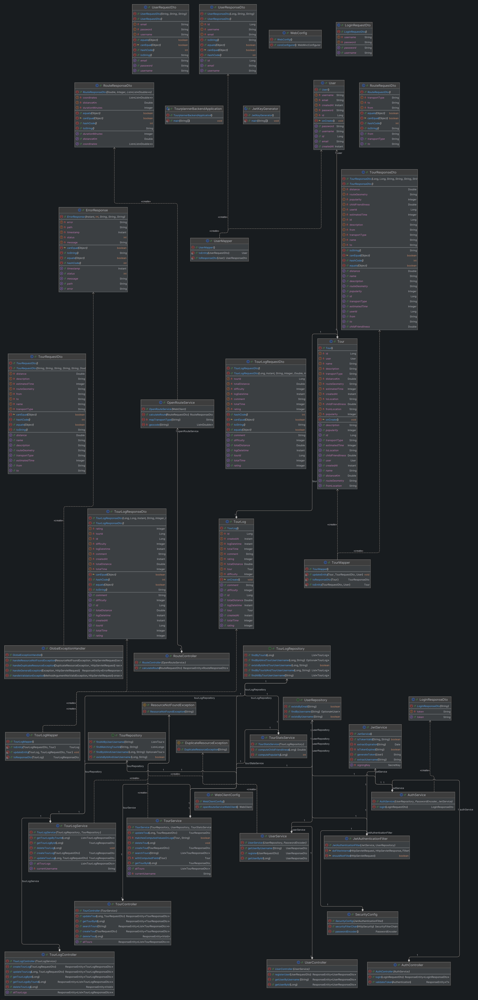

# SWEN-2 Tour Planner - Protocol

**GitHub Link:**
https://github.com/elisabethstagl/SWEN2-Tour-Planner

## Wireframe - UI Flow

The following wireframe represents the initial concept of the application. During development the final user interface evolved to better match the project requirements. The major design changes are described later in this protocol.

### Global Header
The application includes a persistent header displayed across all pages. It contains a search bar for browsing tours and two action buttons that adapt based on the user’s authentication state:

* Logged out: “Login” and “Register”
* Logged in: “Profile” and “+ New Tour”

#### Create Tour ("+ New Tour")
Accessible via the header when logged in. Allows users to create a new tour.
Includes form inputs for all relevant tour details.

### Home Page
The home page serves as the main discovery interface:
Displays a list of public or recommended tours in a list view.
Each tour is presented as a card with key information.
When logged in, users can:
Add tours to their favorites (a planned unique feature).
Clicking on a tour card navigates to the Tour Details Page.

### Authentication Flow

#### Login
Triggered via a modal from the header.
Users can:
* Enter credentials to sign in.
* Navigate to the registration page via a secondary action.

#### Registration Page
Contains a simple form with required user input fields.
Upon successful registration:
* The user is automatically logged in.
* Redirected back to the Home Page.

### Profile Page
The profile page allows users to manage their personal account and content:
* View and edit personal information.
* Access and manage their created tours and their favorite tours
* Acts as a central dashboard for user-specific content.

### Tour Details Page
This page provides a detailed view of a selected tour:

* Displays all tour information (e.g., description, metadata).
* Shows a list of tour logs associated with the tour.

User Actions (when authorized):
* Edit or delete the tour.
* Add new logs to the tour.
* Edit or delete existing logs.


## UML - Use Case Diagram


This use case diagram illustrates the main functionalities of the tour planner app and the interactions between different types of users and external systems.
The system distinguishes between three types of actors:
* **Guest:** An unregistered user who can view public tours and create an account.
* **Registered User:** An authenticated user who has access to extended features such as creating tours, managing tour logs, and importing tour data.
* **External Systems:** A mapping service (Leaflet) for displaying tours visually and a routing service (OpenRouteService) for calculating tour distance and duration.

The diagram also shows relationships between use cases:

* **«include»** relationships represent mandatory functionalities that are always executed as part of another use case (e.g., calculating distance and time when creating a tour).
* **«extend»** relationships represent optional or exceptional flows, such as handling errors (e.g., login failure or tour creation errors).

#### Two example use cases

##### Use Case 1: Log In

**Actor**: Guest

**Description**
This use case describes how a guest logs into the application to become an authenticated (registered) user.

**Preconditions**
* The user already has a registered account.
* The system is accessible.

**Main Flow**
The guest clicks the “Login” button.
A login modal is displayed.
The guest enters their credentials (username/email and password).
The system validates the credentials.
If the credentials are correct:
The user is successfully authenticated.
The system updates the UI (header changes to “Profile” and “+ New Tour”).
The user is redirected to the Home Page.
Alternative Flow (Extension: Login Error)
If the credentials are incorrect:
The system displays a login error message.
The user is prompted to retry login.

**Postconditions**
* **On success:** The user is logged in and gains access to additional features.
* **On failure:** The user remains a guest.

##### Use Case 2: Create a Tour
**Actor**: Registered User

**Description**
This use case describes how a logged-in user creates a new tour, including route calculation and map visualization.

**Preconditions**
* The user is logged in.
* The system is connected to external services (map and routing services).

**Main Flow**
The user clicks the “+ New Tour” button.
The system displays a form for entering tour details (e.g., to, from, description,..).
The user enters the required information.
The system sends data to the routing service.
The system calculates tour distance and time (via OpenRouteService).
Displays the tour on the map (via Leaflet).
The user reviews the generated tour.
The user confirms and saves the tour.
The system stores the tour and makes it available on the home page.

**Alternative Flow (Extension: Tour Calculation Failed)**
If route calculation fails the system displays an error message and the user can adjust input data or retry.

**Alternative Flow (Extension: Creation Error)**
If saving the tour fails the system shows a creation error message and the user may retry saving.

**Postconditions**
* **On success:** The new tour is saved and visible to the user.
* **On failure:** No tour is created

## Technology Stack

| Technology            | Purpose |
|-----------------------|---------|
| Angular               | Frontend framework used to implement the web application |
| TypeScript            | Programming language for Angular |
| Spring Boot           | Backend framework providing REST APIs |
| Java 25               | Backend programming language |
| PostgreSQL            | Relational database for storing users, tours and tour logs |
| Hibernate / JPA       | Object-relational mapper (ORM) |
| Spring Security       | Authentication and authorization |
| JSON Web Tokens (JWT) | Stateless authentication between frontend and backend |
| OpenRouteService API  | Calculates tour distance and estimated duration |
| Leaflet               | Displays tours on an interactive map |
| Docker Compose        | Starts PostgreSQL and pgAdmin |
| Maven                 | Dependency management and backend build tool |
| Angular Material      | User interface components |
| Log4j2                | Logging framework |
| JUnit                 | Unit testing framework |
| Git                   | Version control |

## Project setup
The backend reads its secrets (DB credentials, JWT secret, OpenRouteService API key) from environment
variables instead of `application.yaml`.

### Backend Setup
1. `cd tourplanner-backend`
2. `cp .env.example .env`
3. Fill in `.env` with real values:
    - DB values must match your `docker-compose.yml` / local Postgres instance
    - `JWT_SECRET`: generate with `openssl rand -base64 32`
    - `ORS_API_KEY`: get a free key at https://openrouteservice.org/dev/#/signup
4. `docker compose up -d` (starts Postgres + pgAdmin, also reads `.env`)
5. `./mvnw spring-boot:run` — the `.env` file is loaded automatically on startup

`.env` is gitignored and must never be committed. `.env.example` is the committed template.

### Frontend Setup

Navigate into the frontend folder
```bash
cd tourplanner-frontend
```

Install dependencies
```bash
npm install
```

Start Angular
```bash
ng serve
```

The frontend is available at
```
http://localhost:4200
```

The backend is available at
```
http://localhost:8080
```

## UML Class Diagram


## Sequence Diagram for full-text search

The search first loads all tours belonging to the currently authenticated user. Before filtering, the backend enriches every tour with computed attributes. For each tour, `TourStatsService` calculates the popularity and child-friendliness values.

If the search query is empty, all tours are returned after mapping them to response DTOs. If a search term exists, the database first searches the direct tour fields such as name, description, start location, destination and transport type. Afterwards, the service layer additionally checks computed values and tour logs. This is necessary because popularity and child-friendliness are not simple static input fields but are calculated from tour log data.

Finally, all matching tours are mapped to `TourResponseDto` objects and returned to the Angular frontend, where the result list is updated.


## Designs, Failures and Selected Solutions

## Architecture

The application follows a layered client-server architecture with a separate Angular frontend and Spring Boot backend.

### Frontend Architecture

The frontend is structured into:

- **Pages**: route-level views such as Home, Dashboard, My Tours and Tour Details
- **Components**: reusable UI elements such as header, forms, dialogs and tour cards
- **Services**: communication and state handling, for example `TourService`, `AuthService` and the Leaflet `FacadeService`
- **Guards**: protect routes that require authentication
- **Interceptors**: automatically attach the JWT token to backend requests
- **Models / DTOs**: TypeScript interfaces representing tours, users and tour logs

The frontend focuses on displaying data, handling user interaction and communicating with the backend through HTTP requests.

### Backend Architecture

The backend is structured into the following packages:

- **config**: application and security configuration
- **controllers**: REST endpoints for authentication, users, tours, tour logs, search, import and export
- **dto**: data transfer objects used for API requests and responses
- **entities**: JPA entities mapped to PostgreSQL tables
- **exceptions**: custom exceptions and error handling
- **mapper**: conversion between entities and DTOs
- **repositories**: Spring Data JPA repositories for database access
- **security**: JWT handling, authentication filter and security-related classes
- **services**: business logic and coordination between controllers and repositories

The backend follows a layered architecture. Controllers receive HTTP requests, services contain the business logic, repositories access the database, and entities represent the persistent data model.
### Form Handling – Challenges and Decisions
One of the main challenges during development was choosing the appropriate form handling approach in Angular. 
The available options included:

* Template-driven forms (ngModel)
* Reactive forms
* Signal-based forms (experimental)

There was initial uncertainty regarding which approach integrates best with Angular Material and fits the project requirements.
After evaluating the options, template-driven forms using ngModel were chosen because:

* They were covered in the course materials and examples
* They are simpler to implement for smaller forms
* They were sufficient for the current scope of the application

Template-driven forms proved sufficient for the project's scope and integrated well with Angular Material while keeping the implementation straightforward.

## Design Changes During Development

The application underwent several design changes throughout the development process.

The initial concept focused on a traditional homepage with public tour cards, favorite tours and a profile-centered navigation. As development progressed and the project requirements became clearer, the user interface was redesigned to better support the required functionality and provide a more intuitive user experience.

The final design differs from the original wireframe. Instead of displaying tours on the homepage, the landing page now serves as a simple entry point containing only two buttons: **Login** and **Register**. This keeps the initial interface clean and allows users to authenticate before accessing the application's main functionality.

After a successful login, users are redirected to the **Dashboard**. The dashboard contains a header with a search bar, navigation to the user's tours and a logout button. The main content is an interactive Leaflet map covering most of the page together with a side panel for creating new tours.

The **My Tours** page provides an overview of all tours created by the authenticated user. Selecting a tour opens the corresponding details page, where users can view, edit and manage the tour as well as its associated tour logs.

Overall, the redesign focused on simplifying the user interface by removing unnecessary elements and reducing visual clutter. The final layout is more minimalistic, easier to navigate and better aligned with the project requirements while still providing quick access to all essential features.

### Authentication

Authentication is implemented using Spring Security together with JWT (JSON Web Tokens).

After a successful login the backend generates a signed JWT containing the username and user ID. The frontend stores the token in the browser's localStorage and automatically includes it in the Authorization header for every protected request.

During development we discovered that after deleting the database tables the browser still contained an old JWT. Since the frontend only checked whether a token existed, users could still access protected pages although the user no longer existed.

To solve this issue, a dedicated endpoint (`GET /api/token/validate`) was introduced. Before entering protected routes, the Angular route guard validates the token with the backend. If the backend responds with **401 Unauthorized**, the stored token is removed and the user is redirected to the login page.

Additionally, JWT expiration is verified on every request.

### Import & Export of Tour Data

Export and import operate on all of the current user's tours at once, rather than per individual tour.

For the file format JSON was chosen, since the whole application already communicates via JSON, no additional library or format-specific parsing logic was needed.

The imported tours' owner always comes from the authenticated user in the security context (the same `SecurityContextHolder` lookup used everywhere else in the app), never from any field inside the uploaded file.

The whole `importTours()` call is wrapped in a single `@Transactional` block. If any tour or log in a large import file fails partway through, the entire operation is rolled back rather than leaving a half-imported, inconsistent result.


## Unique Features
### Transport Type Filtering

As a unique feature, the application allows users to filter tours by their transport type.

Each tour is assigned a transport type (e.g., walking, hiking, cycling or driving), which is displayed directly alongside the tour information. Users can use the filter to quickly limit the displayed tours to a specific transport type.
This feature improves the overall usability of the application, especially for users who manage a larger number of tours. Instead of browsing through all available tours, users can immediately focus on tours that match their preferred mode of transportation.

From a technical perspective, the selected transport type is used as an additional filter criterion in the frontend and the displayed tour list is updated dynamically. The transport type is also shown as part of every tour card, providing important information at a glance.

### Favourites
As an additional feature, users can mark individual tours as favorites via a heart icon and filter the list to favorited tours only, both filters (favourites and transport type) can be combined at the same time.
Favoriting is implemented as a single boolean flag per tour, updated via a `PATCH /api/tours/{id}/favorite` request.

## Implemented Design Pattern: Facade Pattern

The project implements the Facade Pattern for the integration of the Leaflet map.

Instead of allowing different components to communicate directly with the Leaflet library, all map-related functionality is encapsulated inside the `FacadeService`. The service provides a simplified interface for displaying maps, creating markers, rendering routes and updating the displayed tour.

Whenever a component needs to display or update a map, it only interacts with the `FacadeService`. The service internally coordinates the communication with Leaflet and hides the implementation details from the rest of the application.

Using the Facade Pattern provides several advantages:

- Components remain independent of the Leaflet API.
- Map-related logic is centralized in a single location.
- Code duplication is reduced.
- Future changes to the map implementation only affect the FacadeService instead of multiple components.
- The application becomes easier to maintain and extend.

### Challenges and Lessons Learned
Several technical challenges were encountered during development.

- Choosing the appropriate Angular form approach required additional research before deciding on template-driven forms.
- Structuring the application into reusable components and services significantly improved maintainability.
- Integrating Leaflet with Angular required separating map functionality into a dedicated FacadeService to avoid coupling UI components to the Leaflet API.
- Implementing address autocomplete with the OpenRouteService Geocoding API proved more complex than initially expected. Different API responses, asynchronous requests and integration with Angular Material's autocomplete component resulted in compatibility issues and unreliable route calculations. Due to time constraints, the feature was postponed for future work.

### Future Improvements

Although the project fulfills the required functionality, several improvements could be made in the future.

- Implement address autocomplete using the OpenRouteService Geocoding API to improve usability during tour creation.
- Add additional filters such as distance, estimated duration or rating.
- Improve responsive behaviour for smaller screen sizes.


## Unit Tests

The backend is tested with 75 JUnit tests. Tests use Mockito to mock repositories and services, so each test exercises only the logic of the class under test, no database or Spring context is needed.

**Why these classes were chosen:**

- `TourService`, `TourLogService`, `UserService`, `AuthService`, `TourImportExportService` contain the core business logic, most importantly the rule that a user may only ever see or modify their own tours and logs, it's a potential security leak, so every service method is tested both for the happy path and for the "not owned by current user" case, which must consistently result in a `ResourceNotFoundException`. `TourImportExportServiceTest` checks that imported tours are always assigned to the current authenticated user regardless of what the uploaded file contains, and that export only returns the current user's own tours. `TourServiceTest` also covers the full-text search implementation.
- `TourStatsService` - the popularity and child-friendliness calculations are pure math with several edge cases (no logs, logs with missing values, extreme values). None of this is enforced by the type system, so incorrect logic would silently produce wrong scores instead of throwing an error.
- `JwtService` - security-critical: if token generation or validation logic is wrong, either invalid tokens get accepted or valid users get locked out. Both directions are tested.
- `TourMapper`, `TourLogMapper`, `UserMapper` - pure mapping logic between DTOs and entities. If a field is added to Tour/TourRequestDto/TourResponseDto (or the TourLog/User equivalents) and someone forgets to add it in the mapper, these tests catch it immediately instead of it silently disappearing between frontend and database. This test ensures that computed values (popularity/childFriendliness) still end up correctly in the response, even though they don't come from the database.
- `TourRequestDtoTest`, `TourLogRequestDtoTest`, `UserRequestDtoTest` verify that the Bean Validation annotations (`@NotBlank`, `@Positive`, `@Size`, …) actually reject the inputs they're supposed to; these annotations are the only thing stopping invalid data from ever reaching the database.

## Tracked Time

### Elisabeth Stagl

#### Intermediate Submission

| Task / Feature                                                  | Time (h) |
|-----------------------------------------------------------------|:--------:|
| Git Repository Setup and Spring Boot Integration                |   0.5    |
| Frontend Pages, Basic Design, Angular Material                  |   4.0    |
| Layout Skeleton and Page Components                             |   2.0    |
| Initial CRUD Implementation and Models                          |   4.5    |
| Create/Delete Tour, Edit/Delete Components                      |   2.5    |
| Form Improvements                                               |   0.5    |
| CRUD for Tours and Tour Logs                                    |   4.0    |
| Protocol                                                        |   1.5    |
| **Subtotal**                                                    | **19.5** |

#### Final Submission

| Task / Feature                                                 | Time (h) |
|----------------------------------------------------------------|:--------:|
| Leaflet Integration                                            |   4.0    |
| Research (Leaflet, ORS, Flyway, Log4j2, JWT, Spring Security…) |   10.0   |
| Database and Flyway                                            |   5.0    |
| Backend Setup                                                  |   3.5    |
| Backend Development                                            |   6.5    |
| Frontend–Backend Communication                                 |   2.0    |
| Authentication (Login)                                         |   5.5    |
| Authorization                                                  |   3.0    |
| OpenRouteService Integration                                   |   7.5    |
| Log4j2 Integration                                             |   1.5    |
| Environment Configuration (.env)                               |   1.0    |
| Computed Tour Attributes                                       |   2.0    |
| Full-Text Search                                               |   3.0    |
| UI Redesign                                                    |   3.0    |
| Final Code Improvements                                        |   2.0    |
| Final Protocol                                                 |   2.5    |
| Code Documentation and Comments                                |   1.0    |
| Bugfixing                                                      |   4.0    |
| **Subtotal**                                                   | **67.0** |


### Valeriia Sineva

#### Intermediate Submission
| Task / Feature                                                              |  Time (h)  | 
|:----------------------------------------------------------------------------|:----------:|
| Git Repo Setup and Angular Integration                                      |    0.5     |
| Use Case Diagram                                                            |    3.0     |
| Frontend Pages, Routing, Logo, Mock Data, Leaflet Integration Preparation   |    5.0     |
| Git Workflow & Merge Conflicts Resolving                                    |    1.5     |
| **Subtotal**                                                                |  **10.0**  |


#### Final Submission
| Task / Feature                   | Time (h) | 
|:---------------------------------|:--------:|
| Backend Refactoring & Bugfixing  |   5.0    |
| Frontend Refactoring & Bugfixing |   1.5    |
| Merge Conflict Resolving         |   2.0    |
| Search                           |   1.0    |
| Favourites                       |   4.5    |
| Import/Export                    |   5.5    |
| Unit Tests                       |   7.0    |
| Protocol                         |   1.5    |
| **Subtotal**                     |  **28**  |


### Total Time

| Contributor     |      Hours |
|-----------------|-----------:|
| Elisabeth Stagl | **86.5 h** |
| Valeriia Sineva | **38.0 h** |