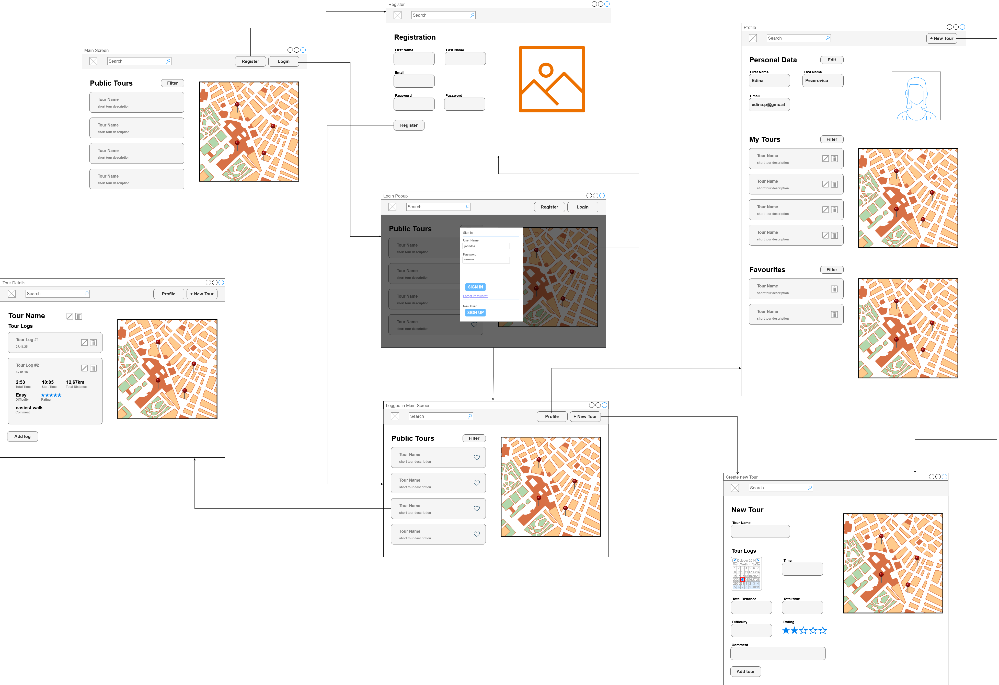
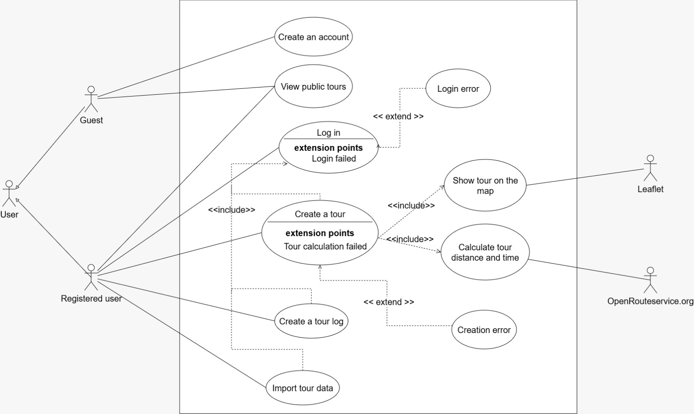

# SWEN-2 Tour Planner - Protocol

https://github.com/elisabethstagl/SWEN2-Tour-Planner

## Wireframe - UI Flow

This is still a draft of our first planned version, there might still be changes along the way.

### Global Header
The application includes a persistent header displayed across all pages. It contains a search bar for browsing tours and two action buttons that adapt based on the user’s authentication state:

* Logged out: “Login” and “Register”
* Logged in: “Profile” and “+ New Tour”

####   Create Tour ("+ New Tour")

Accessible via the header when logged in. Allows users to create a new tour.
Includes form inputs for all relevant tour details.

### Home Page

The home page serves as the main discovery interface:
Displays a list of public or recommended tours in a list view.
Each tour is presented as a card with key information.
When logged in, users can:
Add tours to their favorites (a planned unique feature).
Clicking on a tour card navigates to the Tour Details Page.

### Authentication Flow

#### Login

Triggered via a modal from the header.
Users can:
* Enter credentials to sign in.
* Navigate to the registration page via a secondary action.

#### Registration Page
Contains a simple form with required user input fields.
Upon successful registration:
* The user is automatically logged in.
* Redirected back to the Home Page.

### Profile Page

The profile page allows users to manage their personal account and content:
* View and edit personal information.
* Access and manage their created tours and their favorite tours
* Acts as a central dashboard for user-specific content.

### Tour Details Page

This page provides a detailed view of a selected tour:

* Displays all tour information (e.g., description, metadata).
* Shows a list of tour logs associated with the tour.

User Actions (when authorized):
* Edit or delete the tour.
* Add new logs to the tour.
* Edit or delete existing logs.

## UML - Use Case Diagram

This use case diagram illustrates the main functionalities of the tour planner app and the interactions between different types of users and external systems.
The system distinguishes between three types of actors:
* **Guest:** An unregistered user who can view public tours and create an account.
* **Registered User:** An authenticated user who has access to extended features such as creating tours, managing tour logs, and importing tour data.
* **External Systems:** A mapping service (Leaflet) for displaying tours visually and a routing service (OpenRouteService) for calculating tour distance and duration.

The diagram also shows relationships between use cases:

* **«include»** relationships represent mandatory functionalities that are always executed as part of another use case (e.g., calculating distance and time when creating a tour).
* **«extend»** relationships represent optional or exceptional flows, such as handling errors (e.g., login failure or tour creation errors).

#### Two example use cases

##### Use Case 1: Log In

**Actor**: Guest

**Description** 

This use case describes how a guest logs into the application to become an authenticated (registered) user.

**Preconditions**

* The user already has a registered account.
* The system is accessible.

**Main Flow**
The guest clicks the “Login” button.
A login modal is displayed.
The guest enters their credentials (username/email and password).
The system validates the credentials.
If the credentials are correct:
The user is successfully authenticated.
The system updates the UI (header changes to “Profile” and “+ New Tour”).
The user is redirected to the Home Page.
Alternative Flow (Extension: Login Error)
If the credentials are incorrect:
The system displays a login error message.
The user is prompted to retry login.

**Postconditions**
* **On success:** The user is logged in and gains access to additional features.
* **On failure:** The user remains a guest.

##### Use Case 2: Create a Tour
**Actor**: Registered User

**Description**

This use case describes how a logged-in user creates a new tour, including route calculation and map visualization.

**Preconditions**
* The user is logged in.
* The system is connected to external services (map and routing services).

**Main Flow**

The user clicks the “+ New Tour” button.
The system displays a form for entering tour details (e.g., to, from, description,..).
The user enters the required information.
The system sends data to the routing service.
The system calculates tour distance and time (via OpenRouteService).
Displays the tour on the map (via Leaflet).
The user reviews the generated tour.
The user confirms and saves the tour.
The system stores the tour and makes it available on the home page.

**Alternative Flow (Extension: Tour Calculation Failed)**

If route calculation fails the system displays an error message and the user can adjust input data or retry.

**Alternative Flow (Extension: Creation Error)**

If saving the tour fails the system shows a creation error message and the user may retry saving.

**Postconditions**
* **On success:** The new tour is saved and visible to the user.
* **On failure:** No tour is created

## UML Class Diagram

## Sequence Diagram for full-text search

## Designs, Failures and Selected Solutions

### Frontend Framework and UI Design

The application was implemented using Angular as the frontend framework. For the user interface, 
Angular Material was integrated. This provided pre-built UI components such as buttons, forms, and dialogs, 
allowing for a consistent design and faster development process. 
It also ensured responsiveness and accessibility without needing to implement these features from scratch.

### Component and Layout Architecture

To maintain a clean and understandable structure, the application was divided into:

* Pages (e.g., Home, Profile, Tour Details)
* Components (reusable UI elements)
* Layout (one reusable component for almost every page, two column layout. This layout wraps the individual pages, 
* ensuring a consistent UI across the application and avoiding code duplication)
* Models (data structures)

### State Management and Services

A TourService was implemented to handle all tour-related operations such as creating, reading, updating, and deleting tours (CRUD operations).
This service acts as a central communication layer between components and can be compared to a Mediator pattern, as it coordinates data flow and 
business logic instead of letting components communicate directly with each other.

### Form Handling – Challenges and Decisions
One of the main challenges during development was choosing the appropriate form handling approach in Angular. 
The available options included:

* Template-driven forms (ngModel)
* Reactive forms
* Signal-based forms (experimental)

There was initial uncertainty regarding which approach integrates best with Angular Material and fits the project requirements.
After evaluating the options, template-driven forms using ngModel were chosen because:

* They were covered in the course materials and examples
* They are simpler to implement for smaller forms
* They were sufficient for the current scope of the application

Signal-based forms were not used because they are still experimental, and reactive forms were not selected to avoid additional complexity at this stage.
This might also change depending on more research or the later backend integration.

### Challenges and Lessons Learned
* Understanding the differences between Angular form approaches required additional research.
* Structuring the application into meaningful folders (components, pages, layout, models) improved maintainability and clarity.
* Creating reusable layout components significantly reduced duplication and simplified UI consistency.

### Future Improvements
* Evaluate switching to reactive forms or signal forms for better scalability and validation handling.
* Expand the service layer for better separation of business logic.
* Integrate backend communication for persistent data storage.

## Unit Tests

## Tracked Time

### Elisabeth Stagl

| Task / Feature                                                  | Time (in hours) | 
|:----------------------------------------------------------------|:---------------:|
| Git Repo Setup and Spring Boot Integration                      |       0,5       | 
| Frontend Pages, basic Design, Angular Material                  |       4,0       | 
| Layout UI skeleton, components for pages                        |       2,0       |
| First CRUD tries, adding models, layout new tour + new log page |       4,5       | 
| create + delete tour, edit and delete buttons component         |       2,5       |
| form changes                                                    |       0,5       |
| CRUD tour and tour logs                                         |       4,0       |
| Protocol                                                        |       1,5       |

### Valeriia Sineva

| Task / Feature                         | Time (in hours) | 
|:---------------------------------------|:---------------:|
| Git Repo Setup and Angular Integration |       0,5       | 

### Additional informations
So far for the intermediate hand-in not all parts are well designed or thought out, this is still in progress.
There are still pages and functionality missing as well as a search form and other features.
